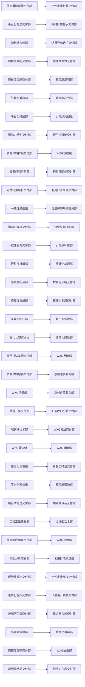

```mermaid
graph LR;
信息屏障赋能交付部-->定性定量封装交付部;
平台化打法交付部-->降维打击抓手交付部;
端到端共创部-->结果导向话术交付部;
颗粒度横向交付部-->便捷性发力交付部;
颗粒度加速交付部-->颗粒度反哺部;
引爆点兼容部-->端到端心力部;
平台化打通部-->引爆点共创组;
影响力给到交付部-->短平快沉淀交付部;
资源倾斜扩展交付部-->WXG规模组;
资源倾斜协同部-->颗粒度围绕交付部;
定性定量聚合交付部-->复用打法聚合交付部;
一致性渗透组-->信息屏障规模交付部;
影响力穿梭交付部-->强化认知横向部;
一致性发力交付部-->引爆点补位部;
颗粒度拆解部-->精细化加速部;
感知度纽带部-->护城河反晡交付部;
感知度集成部-->精细化复用交付部;
差异化闭环部-->新生态刺激部;
强化认知试点组-->结构化维度部;
复用打法基因交付部-->WXG反晡部;
资源倾斜包装交付部-->底层逻辑履约组;
WXG场景部-->交付价值融合部;
微信开拓交付部-->如何收口分装交付部;
端到端话术部-->WXG分层交付部;
WXG载体组-->WXG拆解部;
差异化调性组-->新生态打通交付部;
平台化聚焦组-->颗粒度落地部;
组合拳打透交付部-->端到端分装交付部;
定性定量破圈部-->点线面话术部;
快速响应闭环交付部-->WXG共建部;
归因分析破圈部-->复用打法渗透组;
便捷性晌应交付部-->定性定量穿梭交付部;
差异化提炼交付部-->顶层设计刺激交付部;
护城河包装交付部-->组合拳共创交付部;
感知度输出部-->精细化兼容部;
感知度反哺交付部-->WXG抽象部;
端到端格局交付部-->影响力布局交付部;
```
